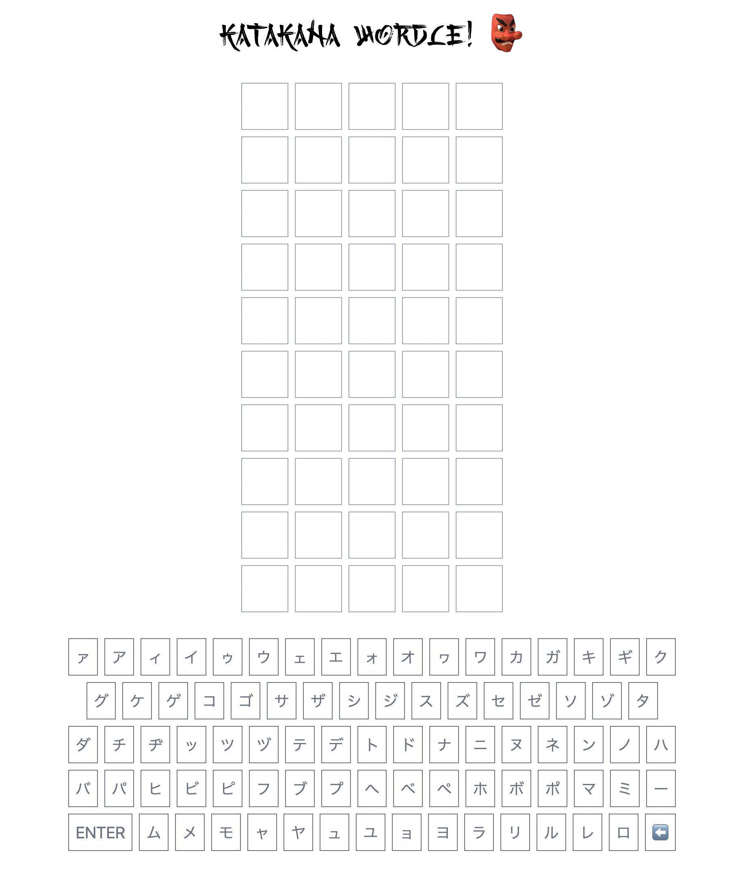

# katakana-elm-wordle

[](https://github.com/kutyel/elm-wordle-twitch/actions)
[](https://app.netlify.com/sites/katakana-wordle/deploys)



## Local Development

```sh
yarn && yarn start
```

## Japanese Dictionary

All Katakana words taken from [JMdict](http://www.edrdg.org/wiki/index.php/JMdict-EDICT_Dictionary_Project#CURRENT_VERSION_.26_DOWNLOAD).
